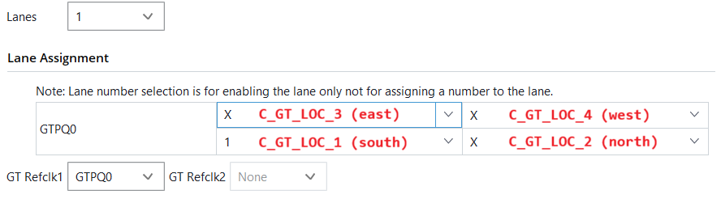

# LPSC - Mandelbrot fractal

**MALLA Massimo** [**massimo.malla@master.hes-so.ch**](mailto:massimo.malla@master.hes-so.ch)

**NICOLOSO Matthias** [**matthias.nicoloso@master.hes-so.ch**](mailto:matthias.nicoloso@master.hes-so.ch)

## Update IP:

settings -> IP -> Repository -> Add mandlebrot/files/ip\_repo

upgrade\_ip \[get\_ips]

## Aurora connectivity table

1. Désactiver l'orientation contenant un '1' en sélectionnant une 'X'
2. Sélectionner la nouvelle orientation avec un '1'

| Cellule     | Constante   | Interface |
|-------------|-------------|-----------|
| bas-gauche  | C_GT_LOC_1  | south     |
| bas-droite  | C_GT_LOC_2  | north     |
| haut-gauche | C_GT_LOC_3  | east      |
| haut-droite | C_GT_LOC_4  | west      |

Les liaisons doivent se faire par paires opposées :

- Nord <-> Sud
- Est <-> Ouest

### Interface AXI-Stream user

- **Envoi :** s_axi_tx_tdata/tvalid/tready
- **Réception :** m_axi_rx_tdata/tvalid

### Dataflow (à vérifier en cours)

**SLAVE -> MASTER :** 
- idx palette de 5 bits pour chaque pixel, selon BRAM

**MASTER -> SLAVE :** 
- cx
- cy
- zoom (profondeur calcul ?)
- ligne_debut
- ligne_fin